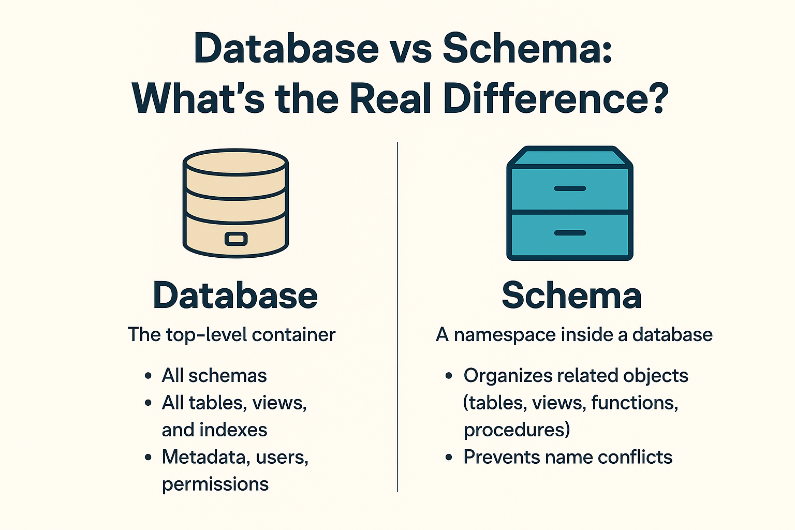

# Database vs Schema vs Table

## 1. Database (The Entire Filing Cabinet)

The **Database** is the highest level container. It is an independent workspace.

* **The Analogy:** It is a locked, heavy-duty physical **Filing Cabinet**.
* **The Rule:** Cabinets don't talk to each other easily. If you are inside the "HR Department" cabinet, you can’t see what’s inside the "Finance Department" cabinet.
* **In Reality:** When you log into PostgreSQL, you create a database for your specific app (e.g., `ecommerce_db`). Everything for that app stays inside that specific "cabinet."

---

## 2. Schema (The Colored Folders inside the Cabinet)

A **Schema** is a logical way to group related things *inside* a single database. It is a folder or a boundary layer.

* **The Analogy:** Open the filing cabinet. Inside, you see bright **colored hanging folders** used to organize the chaos. You have a Blue folder labeled "Public/General," a Red folder labeled "Secure_Admin," and a Green folder labeled "Archived_Data."
* **The Rule:** A schema doesn't hold data itself; it just holds and groups your tables so they don't get messy.
* **In Reality:** By default, PostgreSQL gives you a schema named `public`. If you don't specify a schema, Postgres assumes you are putting everything in the `public` folder. But as a pro, you could create a `billing` schema and an `inventory` schema to keep things separated.

---

## 3. Table (The Paper Forms inside the Folders)

A **Table** is where your actual data lives. It organizes information into strict rows and columns.

* **The Analogy:** Reach inside the Blue folder and pull out a **stack of printed paper forms** (like a sign-up sheet).
* **The Rule:** Every piece of paper (table) has strict **Columns** (the printed questions at the top of the form: *Name, Email, Date of Birth*) and **Rows** (each line where a real person filled out their specific information).
* **In Reality:** This is your `users` table or `orders` table where the actual rows of data are saved.

---

## 🗺️ Summary at a Glance

| Concept | What it is | Real-world Analogy | PostgreSQL Example |
| --- | --- | --- | --- |
| **Database** | The ultimate container for an entire app. | The **Filing Cabinet** | `university_db` |
| **Schema** | A logical folder used to organize topics inside the DB. | A **Hanging Folder** inside | `student_records` |
| **Table** | The actual grid structure holding the real data. | A **Printed Paper Form** | `grades_2026` |

So, when you look for a student's grade, you go to the `university_db` (Cabinet), open the `student_records` (Folder), and look at the `grades_2026` (Form)!

Does seeing it as a physical office cabinet make the relationship between them click a bit better?

