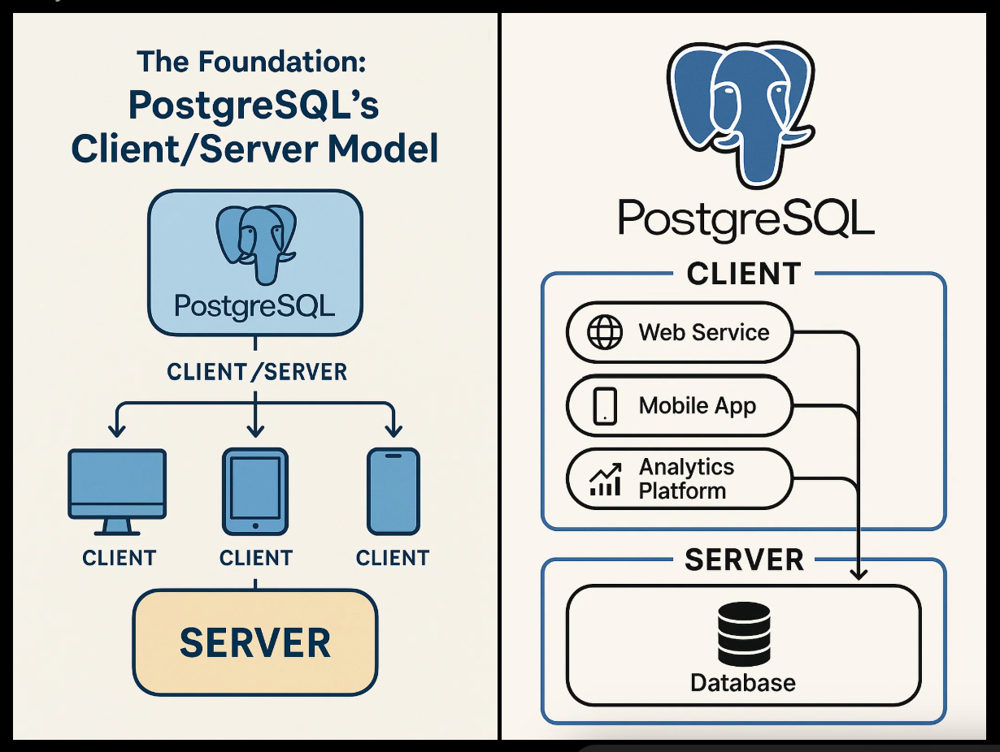

# PostgreSQL Learning Journey 🐘

This directory is part of my personal learning repository:
👉 Main Repo: [Language-Practice](https://github.com/nazmul-1117/Language-Practice)

## 📌 Overview

I am currently learning **PostgreSQL** to strengthen my database fundamentals and improve my backend development skills for internship opportunities.

I already have experience with **MySQL**, so this section focuses on understanding PostgreSQL-specific features, syntax differences, and advanced capabilities.

---

## 🎯 Learning Goals

- Understand PostgreSQL architecture and features
- Compare PostgreSQL vs MySQL differences
- Practice advanced SQL queries
- Learn PostgreSQL data types and constraints
- Work with indexing and query optimization
- Explore transactions and concurrency control
- Learn JSON, arrays, and advanced PostgreSQL features
- Build real-world practice queries and mini-projects

---

## 📚 Topics Covered

### 1. Basics
- PostgreSQL installation and setup
- Database and table creation
- SELECT, INSERT, UPDATE, DELETE
- WHERE, ORDER BY, LIMIT

### 2. Intermediate SQL
- JOINs (INNER, LEFT, RIGHT, FULL)
- GROUP BY and HAVING
- Subqueries
- Aggregate functions

### 3. PostgreSQL Specific Features
- Data types (UUID, JSON, ARRAY, etc.)
- SERIAL vs IDENTITY
- ON CONFLICT (UPSERT)
- RETURNING clause

### 4. Advanced Concepts
- Indexing (B-Tree, Hash)
- Query performance tuning
- Transactions (ACID properties)
- Isolation levels
- Views and materialized views

---

## 🆚 PostgreSQL vs MySQL (Quick Notes)

- PostgreSQL is more feature-rich and standards-compliant
- Better support for complex queries and data types
- Strong support for JSON and advanced indexing
- More suitable for scalable and analytical systems

---

## 🧠 Practice Style

Each topic may include:
- SQL scripts (`.sql` files)
- Notes and explanations
- Example queries
- Practice problems

---

## 🚀 Purpose of This Folder

This folder helps me:
- Track my PostgreSQL learning progress
- Build strong SQL fundamentals
- Prepare for backend development internships
- Create a portfolio of database skills on GitHub

---

## 📎 Related Repo

Main repository:  
👉 https://github.com/nazmul-1117/Language-Practice

---

## 📅 Status

🟡 In Progress — Actively Learning PostgreSQL

---

## 🙌 Notes

This is a personal learning space. Suggestions and improvements are always welcome!

