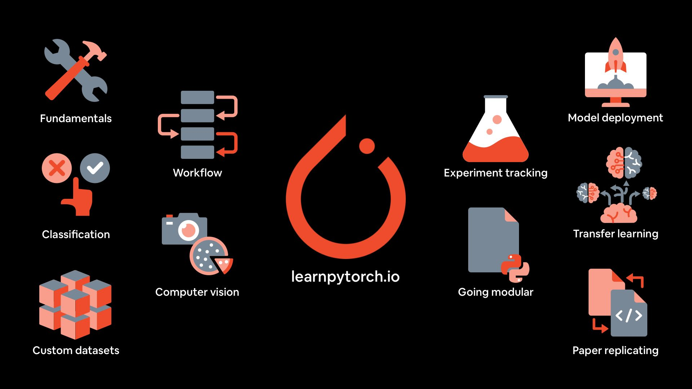

# Day_001 | PyTorch for Beginners | Introduction to PyTorch | Core Concepts and Architecture

## 💡 Introduction to PyTorch

**PyTorch** is an open-source machine learning framework known for its **flexibility, ease of use**, and efficiency in deep learning research and production. Developed initially by **Facebook's AI Research (FAIR) team**, it is built around the fundamental concept of **Tensors** and facilitates the creation of both basic and complex neural network models.

PyTorch is most distinguished by its reliance on a **dynamic computation graph** (often called "define-by-run"), which allows for greater control, easier debugging, and native support for Python control flow in your model definitions.

---

## ⏳ Journey from Lua Torch to Python PyTorch

The modern PyTorch framework is a direct descendant and successor to the much older deep learning library called **Torch**.

### 1. The Original Torch (Lua-based)
* **Language:** Implemented in **C** with a wrapper in the **Lua** scripting language.
* **Era:** Popular in the early 2010s, especially within the deep learning research community at **Facebook** and a few other labs.
* **Limitation:** The reliance on Lua presented a significant barrier to entry for the wider machine learning community, which was standardizing on Python for data science and analysis (due to libraries like NumPy and Pandas).

### 2. The Birth of PyTorch (Python-based)
* **Motivation:** To retain the powerful tensor computation and imperative programming style of Torch while migrating to the widely adopted **Python** ecosystem.
* **Key Development (2016/2017):** PyTorch was launched, essentially porting the core **Torch C backend** and its functionalities (like CUDA support) to a Python API.
* **Adoption:** The combination of Python integration, a dynamic graph, and the powerful research backing (FAIR) led to its rapid adoption, solidifying its position as the preferred tool for academic research and cutting-edge model development (especially after the rise of the **Transformer** architecture).

---

## ✨ Core Features of PyTorch

### 1. Dynamic Computation Graph (Define-by-Run)
* This is the single most important feature. In PyTorch, the network is built and modified *as* the code executes.
* **Benefit:** It simplifies debugging (standard Python tools work seamlessly), and makes it trivial to handle **variable-length inputs** and **complex, dynamic architectures** like those common in sequence-to-sequence (Seq2Seq) models and LLMs.
* 

### 2. Imperative Programming Style
* PyTorch feels like writing regular Python code. You can use standard Python control flow (`if/else` statements, `for` loops) directly in your model's `forward` method.
* **Contrast:** Frameworks using static graphs require pre-compilation, which limits the use of complex logic in the model definition.

### 3. Pythonic & Seamless NumPy Bridge
* PyTorch Tensors are designed to be extremely similar to **NumPy arrays**, making the learning curve shallow for those familiar with the Python data science stack.
* You can easily convert between a PyTorch Tensor and a NumPy array using `torch.from_numpy()` and `tensor.numpy()`.

### 4. Automatic Differentiation (Autograd)
* The `torch.autograd` package automatically calculates all the required **gradients** for tensor operations.
* This is essential for the backpropagation step in training neural networks. You simply call `loss.backward()`, and PyTorch handles the gradient calculation for every required tensor.

### 5. Efficient GPU Acceleration
* PyTorch provides efficient and deep integration with **CUDA** for **NVIDIA GPUs**, allowing tensors and models to be moved to the GPU with a simple command (e.g., `tensor.cuda()` or `tensor.to('cuda')`).

---

## 🧱 Core Libraries and Components

The PyTorch framework is organized into several key modules, each serving a specific purpose.

### 1. `torch`
This is the **core package**. It defines the fundamental data structure: the **PyTorch Tensor**.
* **Tensors:** Multi-dimensional arrays similar to NumPy arrays but with the ability to track computational history and run on GPUs.
* **Tensor Operations:** Contains thousands of functions for arithmetic, logic, indexing, and linear algebra operations on tensors (e.g., `torch.add()`, `torch.matmul()`, `torch.arange()`).

### 2. `torch.autograd`
This is the engine for automatic differentiation.
* **Purpose:** Tracks operations performed on tensors that have `requires_grad=True`.
* **Functionality:** Calculates and stores the gradient of the loss with respect to all parameters after `loss.backward()` is called.

### 3. `torch.nn` (Neural Networks)
The most essential library for building and training neural networks.
* **Base Class:** Defines the **`torch.nn.Module`** class, which is the base container for all neural network layers and entire models.
* **Layers:** Provides common building blocks for deep learning (e.g., `nn.Linear`, `nn.Conv2d`, `nn.ReLU`, `nn.TransformerEncoder`).

### 4. `torch.optim` (Optimization)
A package implementing various **optimization algorithms** used for training models.
* **Purpose:** Updates the model parameters based on the calculated gradients.
* **Algorithms:** Includes implementations of common optimizers like `optim.SGD`, `optim.Adam`, and `optim.Adagrad`.

### 5. `torch.utils.data`
A utility package for efficient data loading and processing.
* **`Dataset`:** An abstract class representing a dataset, responsible for accessing data samples.
* **`DataLoader`:** An iterator that wraps a `Dataset` and provides features like **batching, shuffling, and multi-process data loading** for training efficiency.

### 6. `torch.jit` (JIT Compiler)
The Just-In-Time (JIT) compiler component, which converts PyTorch models into a serializable and optimized format called **TorchScript**.
* **Purpose:** Used to transition research-focused Python models into a **production-ready** environment that can run without the Python interpreter (e.g., in C++).

### 7. `torchvision`, `torchaudio`, `torchtext`
These are domain-specific libraries built on top of the core PyTorch framework.
* **Purpose:** Provide common datasets, model architectures, and data transformations specific to their respective fields (Computer Vision, Audio Processing, and Natural Language Processing).

## Images

<!--    -->