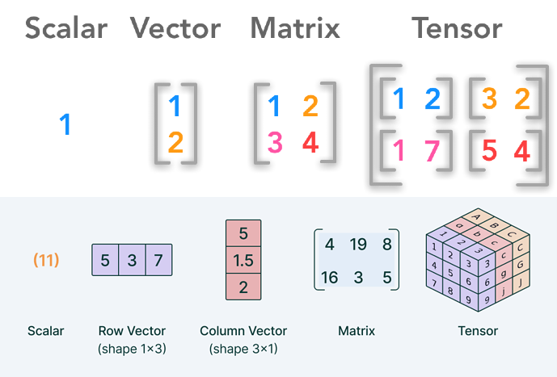
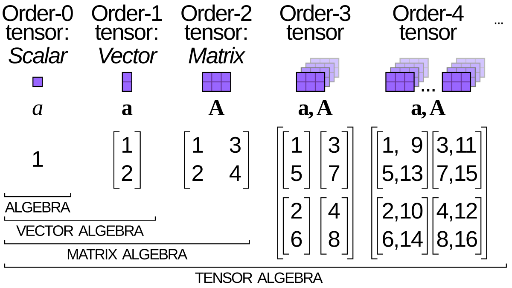

# Day_002 | 🔢 All About PyTorch Tensors

In PyTorch, a **Tensor** is the fundamental data structure, analogous to a **NumPy array**, but with two significant advantages:

1.  They can utilize **GPU acceleration** for dramatic speed improvements in computation.
2.  They form the backbone for **automatic differentiation** (Autograd), which is essential for training neural networks.

Tensors are essentially multi-dimensional matrices used to store data and model parameters (weights, biases) and to perform the calculations (operations) that define a neural network.

-----

## 🏗️ PyTorch Tensor Anatomy

A tensor is defined by several key properties:

### 1\. Rank (or Order)

The number of dimensions a tensor has.
| Rank | Name | Example | Shape |
| :--- | :--- | :--- | :--- |
| **0** | Scalar | A single number (e.g., 5) | `()` |
| **1** | Vector | A list of numbers (e.g., [1, 2, 3]) | `(3,)` |
| **2** | Matrix | A grid of numbers (e.g., [[1, 2], [3, 4]]) | `(2, 2)` |
| **3** | Cube/Volume | A stack of matrices (e.g., Image data: Height x Width x Channels) | `(H, W, C)` |

### 2\. Shape

A tuple that defines the size of the tensor along each dimension.

  * *Example:* A tensor representing a batch of 64 color images of size 28x28 would have a shape of **`(64, 3, 28, 28)`** (Batch Size, Channels, Height, Width).

### 3\. Data Type (`dtype`)

Specifies the type of data stored in the tensor (e.g., integer, floating point). Floating-point types are typically used for model parameters and training due to the need for continuous gradients.

  * **Common Types:**
      * `torch.float32` (default floating-point type)
      * `torch.int64` (default integer type)
      * `torch.bfloat16` and `torch.float16` (used for memory-efficient training, especially with LLMs).

### 4\. Device

Indicates where the tensor is stored—either on the **CPU** or a **GPU** (e.g., `cuda:0`). Operations can only be performed on tensors residing on the same device.

-----

## 🛠️ Creating Tensors

Tensors can be created in many ways using the `torch` package:

| Creation Method | Example Code | Description |
| :--- | :--- | :--- |
| **From Data** | `torch.tensor([1, 2, 3])` | Creates a tensor from a Python list or NumPy array. |
| **Ones/Zeros** | `torch.ones(2, 3)` | Creates a tensor filled with ones of the specified shape. |
| **Random** | `torch.rand(4, 4)` | Creates a tensor with random numbers from a uniform distribution (0 to 1). |
| **Like** | `torch.zeros_like(x)` | Creates a tensor of the same shape and data type as an existing tensor `x`. |

### 🔄 Device Management

Tensors are created on the CPU by default. You can explicitly move them to a GPU:

```python
if torch.cuda.is_available():
    device = torch.device("cuda")
    x = torch.rand(5, 5).to(device)  # Move tensor 'x' to the GPU
    y = x.cpu() # Move tensor 'x' back to the CPU
```

-----

## ⚙️ Tensor Operations

PyTorch supports thousands of tensor operations, including arithmetic, linear algebra, indexing, and slicing.

### 1\. Basic Arithmetic

Element-wise operations (addition, subtraction, multiplication, division).

```python
a = torch.tensor([1, 2])
b = torch.tensor([5, 6])
c = a + b  # c is [6, 8]
d = a * b  # d is [5, 12] (element-wise multiplication)
```

### 2\. Matrix Multiplication

Use `torch.matmul()` or the `@` operator. This is the core operation for layers like `nn.Linear`.
$$C_{ij} = \sum_k A_{ik} B_{kj}$$

```python
mat1 = torch.rand(2, 3)
mat2 = torch.rand(3, 4)
mat3 = mat1 @ mat2 # Result is (2, 4)
```

### 3\. Reshaping and View

Changing the shape of a tensor without changing its data is crucial for feeding data into different layers.

  * **`.reshape()` / `.view()`:** Creates a new view of the tensor with the specified shape. You can use `-1` to let PyTorch automatically infer a dimension size.
  * **`.transpose()` / `.permute()`:** Used to swap dimensions, essential for operations like convolution or attention in Transformers.

### 4\. NumPy Interoperability

Tensors and NumPy arrays share memory, making conversion fast and efficient.

```python
numpy_array = x.numpy()
pytorch_tensor = torch.from_numpy(numpy_array)
```

-----

## 🎓 Tensors and Autograd

For a tensor to be involved in the gradient calculation during backpropagation, it must have its `requires_grad` attribute set to `True`.

  * **Tracking History:** When an operation is performed on a tensor with `requires_grad=True`, the operation itself is recorded, creating the **computational graph**.
  * **Gradient Calculation:** After the loss is calculated, calling **`loss.backward()`** computes the gradient of the loss with respect to all tensors that have `requires_grad=True` and stores them in the tensor's **`.grad`** attribute.

<!-- end list -->

```python
x = torch.tensor([2.0, 3.0], requires_grad=True)
y = x**2  # y = [4.0, 9.0]. The squaring operation is recorded.
z = y.sum() # z = 13.0
z.backward() # Calculates gradients: dz/dx = [4.0, 6.0]
print(x.grad)
# Output: tensor([4., 6.])
```

This automatic gradient tracking is what allows PyTorch to efficiently train complex deep learning models, including the intricate multi-headed attention mechanism of **Transformer-based LLMs**.

## Images


