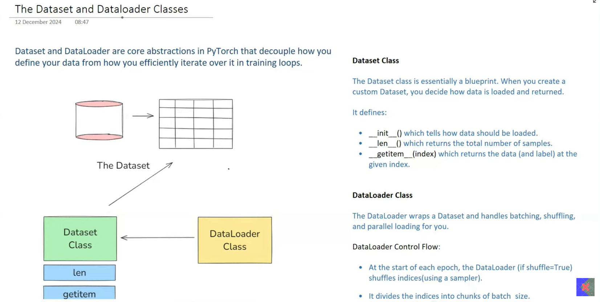
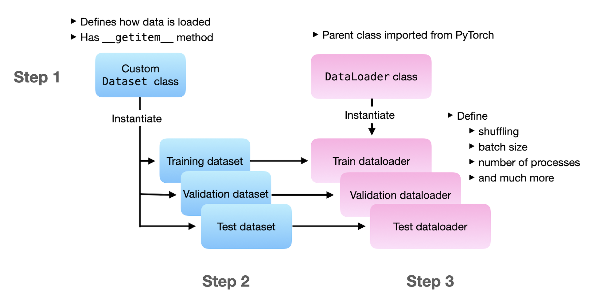
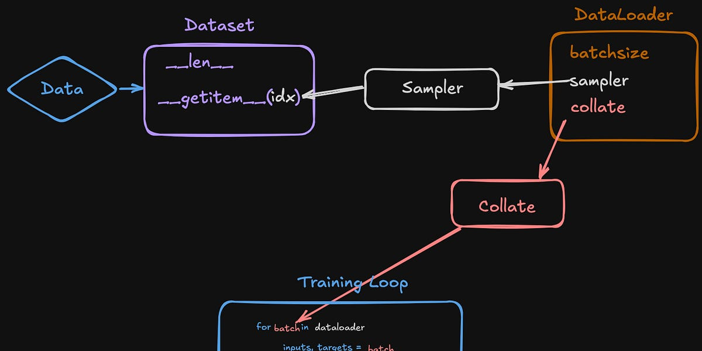

# Day_006 | 🔥 Dataset & DataLoader in PyTorch

## 💾 1. The `torch.utils.data.Dataset` Class

### 💡 What is a Dataset?

The `Dataset` is an abstract base class that represents a **collection of data samples**. It is responsible for organizing the data and providing access to individual samples, typically by index.

### ❓ Why Use a Dataset?

1.  **Abstraction:** It abstracts the process of fetching individual data samples, allowing the `DataLoader` to handle batching and parallelism.
2.  **Sample Retrieval:** It defines *how* a single data point is loaded, preprocessed, or transformed. For example, if you are working with text, the `Dataset` handles tokenizing one sentence; if images, it handles loading one image file from disk.
3.  **Consistency:** It ensures a uniform interface (`__getitem__` and `__len__`) regardless of the data source (files, databases, memory).

### 🛠️ How to Implement a Custom Dataset

To create a functional dataset, you must inherit from `torch.utils.data.Dataset` and override two magical methods:

1.  **`__init__(self, ...)`:**
      * **Purpose:** Initializes file paths, loads indices, and defines any common transforms.
      * **Example:** Loading a list of image file paths and their corresponding labels.
2.  **`__len__(self)`:**
      * **Purpose:** Returns the total number of samples in the dataset.
      * **Example:** `return len(self.image_paths)`.
3.  **`__getitem__(self, index)`:**
      * **Purpose:** Retrieves a single sample (input and target) given an integer index. This is where data loading and transformation happen.

#### Example Implementation Sketch

```python
from torch.utils.data import Dataset
import torch

class CustomTextDataset(Dataset):
    def __init__(self, texts, labels, tokenizer):
        # 1. Store data references and utilities
        self.texts = texts
        self.labels = labels
        self.tokenizer = tokenizer # e.g., a tokenizer for LLMs

    def __len__(self):
        # 2. Return the size of the dataset
        return len(self.labels)

    def __getitem__(self, index):
        # 3. Retrieve, process, and return a single sample
        text = self.texts[index]
        label = self.labels[index]

        # Tokenize the text (specific to LLM work)
        encoding = self.tokenizer.encode_plus(
            text,
            max_length=512,
            truncation=True,
            padding='max_length',
            return_tensors='pt' # Returns PyTorch tensors
        )

        return {
            'input_ids': encoding['input_ids'].flatten(),
            'attention_mask': encoding['attention_mask'].flatten(),
            'label': torch.tensor(label, dtype=torch.long)
        }
```

-----

## 🚀 2. The `torch.utils.data.DataLoader` Class

### 💡 What is a DataLoader?

The `DataLoader` is an **iterator** that wraps a `Dataset` and provides efficient access to batches of data. It is the crucial link that feeds data into the training loop.

### ❓ Why Use a DataLoader?

1.  **Batching:** It groups individual samples retrieved from the `Dataset` into a single batch tensor. This is necessary because GPUs operate most efficiently on large chunks of data.
2.  **Shuffling:** It can randomly shuffle the data order before each epoch, which is vital for preventing the model from learning data order biases.
3.  **Parallelism (`num_workers`):** It uses multiple CPU processes to load data from disk, preprocess it, and move it to memory *while* the GPU is busy training the current batch. This is called **pipeline optimization** and prevents the training process from becoming **CPU-bound**.
4.  **Collation (`collate_fn`):** It handles the automatic stacking of individual samples (tensors) into a single batch tensor.

### 🛠️ Key Parameters of DataLoader

| Parameter | Type | Default | Description |
| :--- | :--- | :--- | :--- |
| **`dataset`** | `Dataset` | (Required) | The Dataset object from which to load the data. |
| **`batch_size`** | `int` | 1 | How many samples per batch to load. |
| **`shuffle`** | `bool` | `False` | Whether to shuffle the data at the beginning of every epoch (set to **`True`** for training). |
| **`num_workers`** | `int` | 0 | **Crucial for performance.** How many subprocesses to use for data loading. 0 means the main process will do all the work (slow). Try setting it equal to the number of CPU cores. |
| **`pin_memory`** | `bool` | `False` | If `True`, the data loader will copy Tensors into CUDA pinned memory before returning them. This speeds up data transfer to the GPU (set to **`True`** when using a GPU). |
| **`collate_fn`** | `callable` | `None` | Custom function to merge a list of individual samples into a batch. **Essential for handling variable-length data** (like different length sentences in LLM data) since the default stack function fails if tensors aren't the same shape. |

#### Example Usage

```python
from torch.utils.data import DataLoader

# Assuming 'train_data' is your CustomTextDataset instance
train_loader = DataLoader(
    dataset=train_data,
    batch_size=32,
    shuffle=True,       # Shuffle data for training stability
    num_workers=4,      # Use 4 processes for loading (adjust based on CPU)
    pin_memory=True     # Speeds up GPU transfer
    # collate_fn=custom_collate_function # Use this for advanced batching
)

# How it's used in the training loop:
for batch in train_loader:
    # batch will contain tensors of size (32, ...)
    input_ids = batch['input_ids'].to(device)
    # ... training steps proceed
```

### 🤝 Relationship: Dataset and DataLoader

The `Dataset` handles **"What"** data to load (single sample logic), and the `DataLoader` handles **"How"** to efficiently load it (batching, shuffling, parallelism).

---

## 1. **What is `Dataset`?**

`torch.utils.data.Dataset` is an abstract class that represents a **collection of data samples**.

### **Purpose**

It tells PyTorch:

* **How to read** a dataset
* **Where to get each item**
* **How many samples** it contains

### **A custom Dataset must implement two methods:**

1. `__len__` — returns total number of samples
2. `__getitem__` — returns a single sample (x, y)

---

## 2. **Why do we need Dataset?**

Because deep learning models need data in a **consistent, indexed format**.
Dataset enables:

* Easy access to items using an index
* Preprocessing each sample
* Plug-and-play with `DataLoader`
* Support for large datasets (load on demand)

---

## 3. **How to use Dataset?**

### **Example: Custom Image Dataset**

> PyTorch

```python
from torch.utils.data import Dataset
from PIL import Image
import os

class MyImageDataset(Dataset):
    def __init__(self, root_dir, transform=None):
        self.root_dir = root_dir
        self.transform = transform
        self.files = os.listdir(root_dir)

    def __len__(self):
        return len(self.files)

    def __getitem__(self, idx):
        img_path = os.path.join(self.root_dir, self.files[idx])
        image = Image.open(img_path)
        
        if self.transform:
            image = self.transform(image)
        
        label = 0  # Dummy label for demonstration
        return image, label
```

---

## 4. **Important Parameters of Dataset**

| Parameter/Method         | Meaning                                   |
| ------------------------ | ----------------------------------------- |
| `__init__()`             | Load paths, read CSV, set transformations |
| `__len__()`              | Total number of items                     |
| `__getitem__()`          | Return sample at index *i*                |
| `transform`              | Image/text transform logic                |
| `target_transform`       | Transform only the label                  |
| `download` (torchvision) | Automatically download dataset            |

---

## 5. **Built-in Datasets in PyTorch**

Located in:
`torchvision.datasets`

Popular ones:

* MNIST
* CIFAR10 / CIFAR100
* ImageNet
* FashionMNIST
* COCO
* CustomFolder datasets

---

## 6. **What is `DataLoader`?**

`DataLoader` creates **mini-batches** from your Dataset.

### **It handles:**

* **Batching**
* **Shuffling**
* **Parallel loading (multiprocessing)**
* **Pinning memory for faster GPU transfer**
* **Drop incomplete batches**
* **Prefetching**

### **Without DataLoader**, you would manually loop through samples—slow and inefficient.

---

## 7. **Why do we need DataLoader?**

Because training requires:

* Mini-batch gradient descent
* Efficient data loading
* Automatic preprocessing
* No memory overload (stream data from disk)

---

## 8. **How to use DataLoader?**

```python
from torch.utils.data import DataLoader

loader = DataLoader(
    dataset=my_dataset,
    batch_size=32,
    shuffle=True,
    num_workers=4,
    pin_memory=True
)
```

---

## 9. **Important Parameters of DataLoader**

| Parameter              | What it does                                  |
| ---------------------- | --------------------------------------------- |
| **dataset**            | Dataset to load                               |
| **batch_size**         | Size of each mini-batch                       |
| **shuffle**            | Randomize sample order each epoch             |
| **num_workers**        | How many subprocesses to use for loading data |
| **pin_memory**         | Speeds up transfer to GPU                     |
| **drop_last**          | Drop last batch if smaller than batch_size    |
| **collate_fn**         | Custom logic to merge samples into a batch    |
| **prefetch_factor**    | How many batches each worker preloads         |
| **persistent_workers** | Keep workers alive between epochs             |

---

## 10. **How DataLoader Works Internally?**

1. It asks Dataset:
   `"How many samples do you have?"` → `__len__`
2. Then creates batches of indices
3. For each batch, workers call:
   `dataset.__getitem__(idx)`
4. `collate_fn` merges items into batch tensors
5. If CUDA: memory transfer happens (with pin_memory=True)

---

## 11. **Complete Example**

> PyTorch

```python
from torch.utils.data import Dataset, DataLoader
import torch

class SimpleDataset(Dataset):
    def __init__(self):
        self.data = torch.arange(100)

    def __len__(self):
        return len(self.data)

    def __getitem__(self, idx):
        x = self.data[idx]
        y = x * 2
        return x, y

dataset = SimpleDataset()

loader = DataLoader(dataset, batch_size=10, shuffle=True)

for batch_idx, (x, y) in enumerate(loader):
    print(batch_idx, x, y)
```

---

## 12. **Best Practices**

### ✔ Set `num_workers` properly

* 0 → if debugging or Windows
* 2–8 → for Linux systems depending on CPU cores

### ✔ Always use `pin_memory=True` when training on GPU

Improves transfer speed.

### ✔ Use `persistent_workers=True` for faster multi-epoch loading

### ✔ Custom **collate_fn** for variable-size data

(e.g., sequences, audio, NLP)

---

## 13. **Dataset + DataLoader Flow**

```
Dataset → DataLoader → Batches → Model → Loss → Optimizer
```

---

## 14. **Dataset vs DataLoader (Summary)**

| Feature    | Dataset                           | DataLoader                               |
| ---------- | --------------------------------- | ---------------------------------------- |
| Purpose    | Store & provide access to samples | Provide batches & loading logic          |
| Implements | `__len__`, `__getitem__`          | Batch creation, shuffle, multiprocessing |
| Example    | How to read images                | How many images per batch                |
| Memory     | Efficient (load on demand)        | Efficient (parallel loading)             |

---

## ✔ Final Summary

* **Dataset** → defines *WHAT* your data is
* **DataLoader** → defines *HOW* your data is loaded
* Together they form the **data pipeline for PyTorch models**

---

## Images


