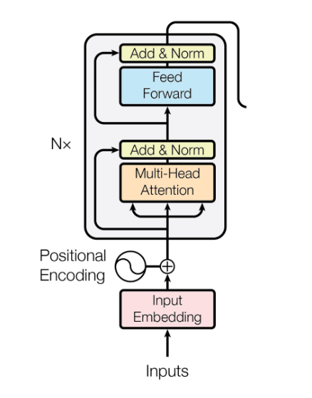

# Day_015 | Transformer Encoder

That's great\! Since you've mastered the theory and even implemented it in Keras, you have a huge head start. Implementing the **Transformer** architecture in PyTorch will mostly be a matter of adapting the Keras concepts (like `tf.keras.layers.Layer` or `tf.keras.Model` subclassing) to **`torch.nn.Module`**.

PyTorch provides high-level components that make the implementation cleaner and more idiomatic.

Here is a structured guide to implementing the **Transformer Encoder** (the core component used in models like BERT) and the essential helper functions in PyTorch.

-----

## 🛠️ Step 1: Positional Encoding

You need a fixed layer to inject sequential information into the input embeddings.

```python
import torch
import torch.nn as nn
import math

class PositionalEncoding(nn.Module):
    def __init__(self, d_model, max_len=5000):
        super(PositionalEncoding, self).__init__()
        
        # Create a tensor of shape (max_len, d_model)
        position = torch.arange(max_len).unsqueeze(1)
        
        # Calculate the divisor term (10000^(2i/d_model))
        div_term = torch.exp(torch.arange(0, d_model, 2) * -(math.log(10000.0) / d_model))
        
        pe = torch.zeros(max_len, d_model)
        
        # Apply sine to even indices and cosine to odd indices
        pe[:, 0::2] = torch.sin(position * div_term)
        pe[:, 1::2] = torch.cos(position * div_term)
        
        # Add batch dimension and register as buffer (not a trainable parameter)
        self.pe = pe.unsqueeze(0) 
        self.register_buffer('pe_buffer', self.pe)

    def forward(self, x):
        # x shape: (batch_size, sequence_length, d_model)
        # Add positional encoding to the input embedding
        x = x + self.pe_buffer[:, :x.size(1)]
        return x
```

-----

## 🔑 Step 2: Multi-Head Attention

PyTorch provides `nn.MultiheadAttention`, which performs the core scaled dot-product attention operation efficiently.

A single **Encoder Layer** will use two main sub-components:

### 1\. The Multi-Head Attention Block

```python
class TransformerEncoderLayer(nn.Module):
    def __init__(self, d_model, nhead, dim_feedforward, dropout=0.1):
        super(TransformerEncoderLayer, self).__init__()
        
        # Multi-Head Attention (MHA)
        self.self_attn = nn.MultiheadAttention(d_model, nhead, dropout=dropout, batch_first=True)
        
        # Feed-Forward Network (FFN)
        self.linear1 = nn.Linear(d_model, dim_feedforward)
        self.dropout = nn.Dropout(dropout)
        self.linear2 = nn.Linear(dim_feedforward, d_model)
        
        # Normalization and Dropout layers
        self.norm1 = nn.LayerNorm(d_model)
        self.norm2 = nn.LayerNorm(d_model)
        self.dropout1 = nn.Dropout(dropout)
        self.dropout2 = nn.Dropout(dropout)

    def forward(self, src, src_mask=None, src_key_padding_mask=None):
        # 1. Self-Attention Sub-Layer
        # MHA output needs its own input for Q, K, and V (Self-Attention)
        attn_output, attn_weights = self.self_attn(src, src, src, 
                                                   attn_mask=src_mask,
                                                   key_padding_mask=src_key_padding_mask)
        
        # Add & Norm (Residual Connection + Layer Normalization)
        src = src + self.dropout1(attn_output)
        src = self.norm1(src)

        # 2. Feed-Forward Sub-Layer
        ffn_output = self.linear2(self.dropout(F.relu(self.linear1(src))))
        
        # Add & Norm (Residual Connection + Layer Normalization)
        src = src + self.dropout2(ffn_output)
        src = self.norm2(src)
        
        return src
```

-----

## 💻 Step 3: The Full Transformer Encoder

The full encoder is a stack of multiple identical `TransformerEncoderLayer` modules.

```python
import torch.nn.functional as F

class TransformerEncoder(nn.Module):
    def __init__(self, vocab_size, d_model, nhead, num_layers, dim_feedforward, dropout=0.1, max_len=512):
        super(TransformerEncoder, self).__init__()
        
        # Input: Embedding + Positional Encoding
        self.token_embedding = nn.Embedding(vocab_size, d_model)
        self.positional_encoding = PositionalEncoding(d_model, max_len)
        self.dropout = nn.Dropout(dropout)

        # Create a stack of N encoder layers
        encoder_layer = TransformerEncoderLayer(d_model, nhead, dim_feedforward, dropout)
        self.encoder_stack = nn.ModuleList([encoder_layer for _ in range(num_layers)])
        
        # Optional: Final Layer Norm, often used before the classification head
        self.final_norm = nn.LayerNorm(d_model)
        
    def forward(self, src, src_mask=None, src_key_padding_mask=None):
        # src shape: (batch_size, sequence_length) -> token indices
        
        # 1. Embed and Add Position
        src = self.token_embedding(src) * math.sqrt(self.token_embedding.embedding_dim) # Scale embedding
        src = self.positional_encoding(src)
        src = self.dropout(src)

        # 2. Pass through the stack of layers
        for layer in self.encoder_stack:
            src = layer(src, src_mask, src_key_padding_mask)
            
        src = self.final_norm(src)
        
        # Output shape: (batch_size, sequence_length, d_model)
        return src
```

-----

## ✅ Step 4: Putting it Together (Example Initialization)

To test your implementation, you can initialize the model and pass some dummy data.

```python
# Hyperparameters
VOCAB_SIZE = 10000   # Size of your vocabulary
D_MODEL = 512        # Embedding dimension (d_model)
N_HEAD = 8           # Number of attention heads
NUM_LAYERS = 6       # Number of encoder blocks
DIM_FEEDFORWARD = 2048 # Feed-forward network inner dimension
SEQUENCE_LENGTH = 128
BATCH_SIZE = 32

# Instantiate the Encoder
encoder = TransformerEncoder(
    vocab_size=VOCAB_SIZE, 
    d_model=D_MODEL, 
    nhead=N_HEAD, 
    num_layers=NUM_LAYERS, 
    dim_feedforward=DIM_FEEDFORWARD
)

# Create dummy input data (token indices)
dummy_input = torch.randint(0, VOCAB_SIZE, (BATCH_SIZE, SEQUENCE_LENGTH))

# Run the forward pass
output_features = encoder(dummy_input)

print(f"Input shape: {dummy_input.shape}")
print(f"Output features shape: {output_features.shape}")
# Expected Output: torch.Size([32, 128, 512])
```

The next step would be to build the full **Encoder-Decoder** structure and integrate this into a training loop for a sequence-to-sequence task, or add a classification head on top of the encoder for tasks like sentiment analysis (BERT-style).

## Images
